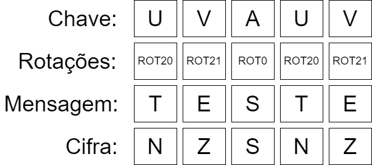

# Cifra de Vigenere

## O que é?

A cifra de vigenere é uma metodologia de criptografia de substituição polialabética inventada por Leon Battista Alberci por volta de 1465 e implementa sua cifração utilizando uma série de diferentes cifras de César, cujo a sequência é definida por uma palavra chave. De forma que cada letra da palavra chave irá determinar um ROTX a cifrar a mensagem, e essa sequência de ROTX é repetida ao longo de toda a mensagem a fim de cifra-la.

Para contextualizar, suponha a utilização da palavra UVA como chave para a mensagem, a letra U está na posição 21 do alfabeto, por tanto equivale a um ROT20, ou seja a letra criptografada pelo U sofrerá uma rotação de 20 posições, a letra V por sua vez equivale a um ROT21, e a letra A equivale a um ROT0, dessa forma, a letra criptografada pelo A não se altera. Tome como exemplo a imagem abaixo, onde a mensagem "TESTE" é cifrada pela chave UVA.

----

## Implementação

A implementação da cifra está definida no arquivo ``vigenere.py`` nele realiza-se a cifração e decifração através da função translate, nela são passados os parâmetros text, key e decript que são respectivamente, o texto (a ser cifrado ou decifrado), a chave da cifração e uma flag que indica se o programa deve cifrar ou decifrar o texto inserido.

Para o tratamento de caracteres especiais da lingua portuguesa, foi criada a função standardize que transforma todas as letras em maiúsculas pelo método str.upper e substitui caracteres especiais e letras acentuadas pelo correspondente não especial, como o "c" no caso do "ç". Espaços não são cifrados ou decifrados neste caso.

## Quebra da cifra

Para a quebra da cifra, foi utilizada a análise de frequência, técnica identificada por Charles Babbage e formalizada pelo matemático Kasiski, que busca sequências de letras que se repetem ao longo da cifra. Ao obter essas sequências que se repetem e  analisar o espaçamento entre suas repetições é muito provável de se obter um indicador do tamanho da chave de cifração.

Com o indicador de tamanho da chave, são obtidos as enésimas letras do texto criptografado e são realizadas tentativas de decifração com as possíveis chaves. A partir dessas tentativas de decifração, são comparadas as frequências de letras da mensagem obtida, com a frequência de letras do alfabeto da mensagem e com essa comparação, é obtido um score, que caso ultrapasse um limiar, a chave e uma parte do texto decifrado por esta são exibidos na tela e o usuário é questionado sobre a eficácia da chave encontrada, caso esta seja confirmada, o texto decifrado é exibido na integra e o programa finaliza sua execução
